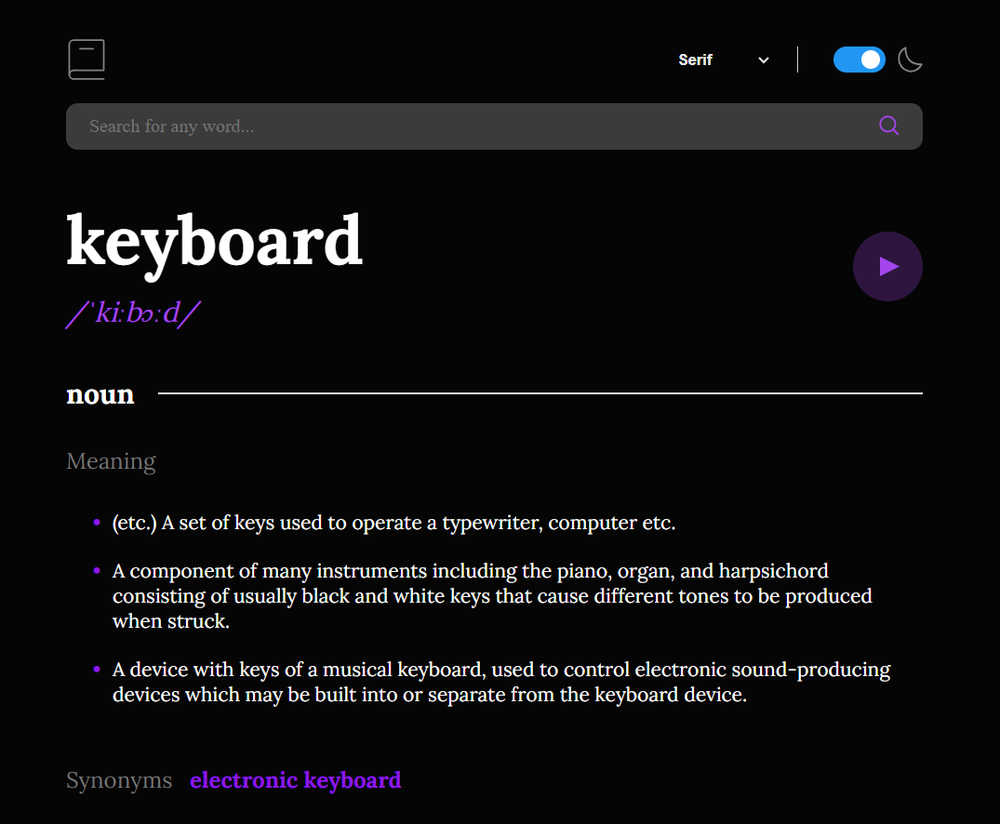

## Frontend Mentor - Dictionary web app solution

This is a solution to the [Dictionary web app challenge](https://www.frontendmentor.io/challenges/dictionary-web-app-h5wwnyuKFL).

## Table of contents

- [Frontend Mentor - Dictionary web app solution](#frontend-mentor---dictionary-web-app-solution)
- [Table of contents](#table-of-contents)
- [Overview](#overview)
  - [The challenge](#the-challenge)
  - [Screenshot](#screenshot)
  - [Links](#links)
  - [Built with](#built-with)
  - [Author:](#author)

## Overview

### The challenge

Users are able to:

- [x] Search for words using the input field
- [x] See the Free Dictionary API's response for the searched word
- [x] See a form validation message when trying to submit a blank form
- [x] Play the audio file for a word when it's available
- [x] Switch between serif, sans serif, and monospace fonts
- [x] Switch between light and dark themes
- [x] View the optimal layout for the interface depending on their device's screen size
- [x] See hover and focus states for all interactive elements on the page

- [ ] Have the correct color scheme chosen for them based on their computer preferences. _Hint_: Research `prefers-color-scheme` in CSS.

### Screenshot

### Links

- Solution URL: [https://www.frontendmentor.io/solutions/dictionary-app-using-react-and-tailwind-dl-\_MuX5Ld](https://www.frontendmentor.io/solutions/dictionary-app-using-react-and-tailwind-dl-_MuX5Ld)
- Live Site URL: [https://dictionary-react-application.vercel.app/](https://dictionary-react-application.vercel.app/)

### Built with

- [React](https://reactjs.org/) - JS library
- CSS modules

### Author:

Frontend Mentor - [@bilal](https://www.frontendmentor.io/profile/M-Bilal1)
